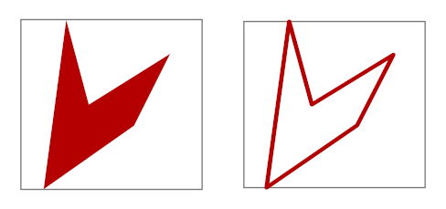

.. Copyright (c) 2011 Francesco Abbate
   
   Permission is hereby granted, free of charge, to any person obtaining a copy
   of this software and associated documentation files (the "Software"), to deal
   in the Software without restriction, including without limitation the rights
   to use, copy, modify, merge, publish, distribute, sublicense, and/or sell
   copies of the Software, and to permit persons to whom the Software is
   furnished to do so, subject to the following conditions:

   The above copyright notice and this permission notice shall be included in
   all copies or substantial portions of the Software.

   THE SOFTWARE IS PROVIDED "AS IS", WITHOUT WARRANTY OF ANY KIND, EXPRESS OR
   IMPLIED, INCLUDING BUT NOT LIMITED TO THE WARRANTIES OF MERCHANTABILITY,
   FITNESS FOR A PARTICULAR PURPOSE AND NONINFRINGEMENT. IN NO EVENT SHALL THE
   AUTHORS OR COPYRIGHT HOLDERS BE LIABLE FOR ANY CLAIM, DAMAGES OR OTHER
   LIABILITY, WHETHER IN AN ACTION OF CONTRACT, TORT OR OTHERWISE, ARISING FROM,
   OUT OF OR IN CONNECTION WITH THE SOFTWARE OR THE USE OR OTHER DEALINGS IN
   THE SOFTWARE.

.. highlight:: c++

Vertex Source Transforms
========================

In the previous chapter we have seen how we can use some vertex source objects like :cpp:class:`path_storage` to define any kind of geometric shapes. In this chapter we will discuss some very useful AGG classes that transforms a given vertex source object to a different one based on some specific rules. These kind of transformations can be 'pipelined' or chained together to easily define very complex object.

So a vertex source transform can be defined as a class that take one or more vertex source object references and returns an instance that is itself a vertex source object. This property of taking a vertex source in the input and giving a vertex source in output allows the combination on any number of transforms in a graphical pipeline.

Let us now illustrate some of the more important transforms to better illustrate the idea.

Stroking
--------

The 'stroke' transform act on a given path, either a open or a closed one, and transform it to its outline. In term of mathematical topology we can say that it transform a set into its frontier. In very simple term we can express the idea by saying that it gives a lines that follow the boundary of the polygon. The object that you will obtain will be also a closed polygone with a non-zero width that outline the contour of the object.

To better illustrate the idea it let us shown un example. In the previois chapter we have seen how to create an irregular polygon using a :cpp:class:`path_storage` object. Let us see now how we can apply to it a 'stroke' transform and how the results looks like. Here the code with the definitions::

  // we define the polygon as before
  agg::path_storage p;
  p.move_to(0.0,  0.0);
  p.line_to(20.0, 15.0);
  p.line_to(28.0, 32.0);
  p.line_to(10.0, 20.0);
  p.line_to(5.0,  40.0);
  p.close_polygon();

  // we create a stroke object that takes the polygon as argument
  agg::conv_stroke<agg::path_storage> line(p);

  // we set the width of the stroke transform
  line.width(1.0);

You can see that to define the 'stroke' transform we have used the class :cpp:class:`agg::conv_stroke`. This class takes a template argument which is the type of the base object, in this case a :cpp:class:`agg::path_storage`. The constructor of the stroke transform is trivial and it just takes a reference to the input object.

We show in the image below the results of the path ``p`` without transforms, on the left, and with a stroke transform, on the right.

   An simple closed polygon and the result of a stroke transform

