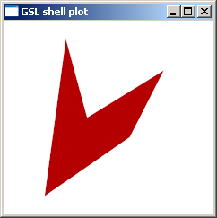

.. Copyright (c) 2011 Francesco Abbate
   
   Permission is hereby granted, free of charge, to any person obtaining a copy
   of this software and associated documentation files (the "Software"), to deal
   in the Software without restriction, including without limitation the rights
   to use, copy, modify, merge, publish, distribute, sublicense, and/or sell
   copies of the Software, and to permit persons to whom the Software is
   furnished to do so, subject to the following conditions:

   The above copyright notice and this permission notice shall be included in
   all copies or substantial portions of the Software.

   THE SOFTWARE IS PROVIDED "AS IS", WITHOUT WARRANTY OF ANY KIND, EXPRESS OR
   IMPLIED, INCLUDING BUT NOT LIMITED TO THE WARRANTIES OF MERCHANTABILITY,
   FITNESS FOR A PARTICULAR PURPOSE AND NONINFRINGEMENT. IN NO EVENT SHALL THE
   AUTHORS OR COPYRIGHT HOLDERS BE LIABLE FOR ANY CLAIM, DAMAGES OR OTHER
   LIABILITY, WHETHER IN AN ACTION OF CONTRACT, TORT OR OTHERWISE, ARISING FROM,
   OUT OF OR IN CONNECTION WITH THE SOFTWARE OR THE USE OR OTHER DEALINGS IN
   THE SOFTWARE.

.. highlight:: c++

Geometric Shapes
================

Right now we have been how to work with rendering buffer and how to write or blend some pixels at some specific location. Of course there is much more than that in a library for 2D graphics and in this chapter we will see how to define some geometric shapes like, polygons, lines, circles etc. We will see that AGG does use templates and it is able to provide a lot of flexibity by providing at the same time optimal performance with compile time optimizations.

We well see that you can combine toghether geometric primitives on any kind with geometric transformations to build composite objects in a very powerful and flexible way. For the other side the drawback is that there are no simple C-style inteface to create geometrical objects but we will see that you can create one if it is needed or useful for your application.

.. _vs-methods:

Vertex Source Concept
---------------------

In order to understand how AGG handle geometrical shapes we need to understand the concept of "vertex source". This concept is not formally defined but it is required by the C++ interface for the various function template definitions.

So what is a vertex source ? The question is very simple, any class that implements the following methods::

  void rewind(unsigned path_id);
  unsigned vertex(double* x, double* y);

either as virtual or non-virtual methods. There is also an additional method which is defined in some classes but which is not part of the vertex source concept::

  void approximation_scale(double scale);

For the moment let us focus on the first two methods but let us explain before how a vertex source works. This kind of object is supposed to provide, when requested, a sequence of vertices and a related command. The command should indicate the type of operations that shold be performed when going to the vertex coordinates. The more widely used type of operations are 'move_to', to indicate a move to the point and 'line_to' to indicate a line drawn up to the given vertex. The complete list of the commands is defined in ``agg_basics.h``::

    enum path_commands_e
    {
        path_cmd_stop     = 0,        //----path_cmd_stop    
        path_cmd_move_to  = 1,        //----path_cmd_move_to 
        path_cmd_line_to  = 2,        //----path_cmd_line_to 
        path_cmd_curve3   = 3,        //----path_cmd_curve3  
        path_cmd_curve4   = 4,        //----path_cmd_curve4  
        path_cmd_curveN   = 5,        //----path_cmd_curveN
        path_cmd_catrom   = 6,        //----path_cmd_catrom
        path_cmd_ubspline = 7,        //----path_cmd_ubspline
        path_cmd_end_poly = 0x0F,     //----path_cmd_end_poly
        path_cmd_mask     = 0x0F      //----path_cmd_mask    
    };

In the same file there is also the definition for some simple test functions like the followings::

    bool is_stop(unsigned c);
    bool is_move_to(unsigned c);
    bool is_line_to(unsigned c);
    bool is_curve(unsigned c);

This latter function, for example, tests if the command is a ``curve3`` or a ``curve4``.

You don't need to master all the path commands to do useful drawings with AGG since most function or class will process the commands and perform the related operation automatically but having a basic understanding how these commands is nevertheless useful.

The other method of a vertex source is the :cpp:func:`rewind` method. This latter just 'rewind' the vertex source to the beginning so that you can unroll it again. The ``path_id`` is needed because some object can store more than one path but in most cases only the default path with ``path_id = 0`` will be used.

May be that now we are ready for a review of the most important type of vertex source objects.

Path Storage Object
-------------------

The most important geometric object that you should know is the :cpp:class:`agg::path_storage` object. You can think to it just like an object that stores a sequence of commands with vertex coordinates and return them using the standard vertex source functions. To close the polygon you should simple call the path_storage method :cpp:func:`close_polygon`.

You should add the commands in sequence to build the figure that you want. For example the following code snippet will build an irregular polygon::

  agg::path_storage p;
  p.move_to(0.0,  0.0);
  p.line_to(20.0, 15.0);
  p.line_to(28.0, 32.0);
  p.line_to(10.0, 20.0);
  p.line_to(5.0,  40.0);
  p.close_polygon();

Here a figure of what you can obtain with an antialiased rasterizer with a solid color.

Note also that the path storage and any vertex source in general has no concept of being 'filled' or not. We will see later that if the polygon is filled or not depends in the way you render it. The most common pipeline for antialised drawings use a renderer :cpp:class:`agg::renderer_scanline_aa_solid` and a rasterizer of type :cpp:class:`agg::rasterizer_scanline_aa`. When these this couple or renderer and rasterizer are used you will obtain filled polygons with an uniform color. You should know anyway that there are other kind of rasterizers and renderers that can be used to obtain different results. For example if you use a renderer :cpp:class:`agg::renderer_outline_aa` and a rasterizer of type :cpp:class:`agg::rasterizer_outline_aa` the path will be rendered as a contour line instead of being filled.

You may wonder at this point if you need to adopt in your application several kind or renderers and rasterizers or if you can stick to a fixed rendering pipeline. There is no general answer to this question because each application can have different need but in general, if you want to perform only anti-aliased drawings, you can always use a :cpp:class:`agg::renderer_scanline_aa_solid` and a :cpp:class:`agg::rasterizer_scanline_aa`. With this kind of pipeline you can still draw lines but in this case you should use the transform :cpp:class:`conv_stroke` that we will describe in the next section.

Other Geometric Objects
-----------------------

In the previous section we have seen :cpp:class:`agg::path_storage` object. While this object is very flexible and can be used to describe all kind of geometric shapes there are a few other vertex source primitive types. Actually there are not so many of them and we will just discuss the :cpp:class:`agg::ellipse` object because it will be also useful to illustrate some important idea.

The :cpp:class:`agg::ellipse` does not share anything with a :cpp:class:`agg::path_storage` in term of C++ class hierarchy, all the they have in common is that they implement the basic :ref:`methods of a vertex source <vs-methods>`. You may wonder why the ellipse object can be useful if you can describe it with a :cpp:class:`agg::path_storage`. The answer is that this latter needs to store a fixed number of vertices that approximate the ellipse for all the possible resolution of the image. The problem is that if you draw a small circle a few vertices can be enough but if the circle is big you are going to need a lot of vertices to have a decent approximation. We will see that with an :cpp:class:`agg::ellipse` object the number of points will be adapted on the fly, you just need to use the :cpp:func:`approximation_scale` method. Actually the :cpp:class:`agg::ellipse` does not store all the coordinates of the vertices but generetes them on the fly when needed using the mathematical equations. As a side effect you will have also a benefit in term of memory usage because an ellipse object will use a very small amount of memory indipendently of the approximation level that you may request.

At this point we need to explain the :cpp:func:`approximation_scale` method. :cpp:func:`approximation_scale` we need to go back to the coordinates specifications. The coordinates are actually given as double precision floating point number and they may or may not map directly to pixel coordinates. For example we can map some logical coordinates ranging from 0 to 1 to an huge viewport of size 1280x1280. The problem at this point is that an :cpp:class:`agg::ellipse` object does not know the mapping between logical coordinates and viewport coordinates. So the idea is that to let :cpp:class:`agg::ellipse` adjust correctly the level of approximation you should call the method :cpp:func:`approximation_scale` and pass as an argument the ratio between the viewport coordinates and the logical coordinates. So in the example of the viewport of size 1280x1280 we would need to use :cpp:func:`approximation_scale` with an scale argument of 1280.

We will see later that the :cpp:func:`approximation_scale` is also important with some kind of transformation like Bezier curves that are supposed to generate smooth curves based on a few vertices and some mathematical equations.
